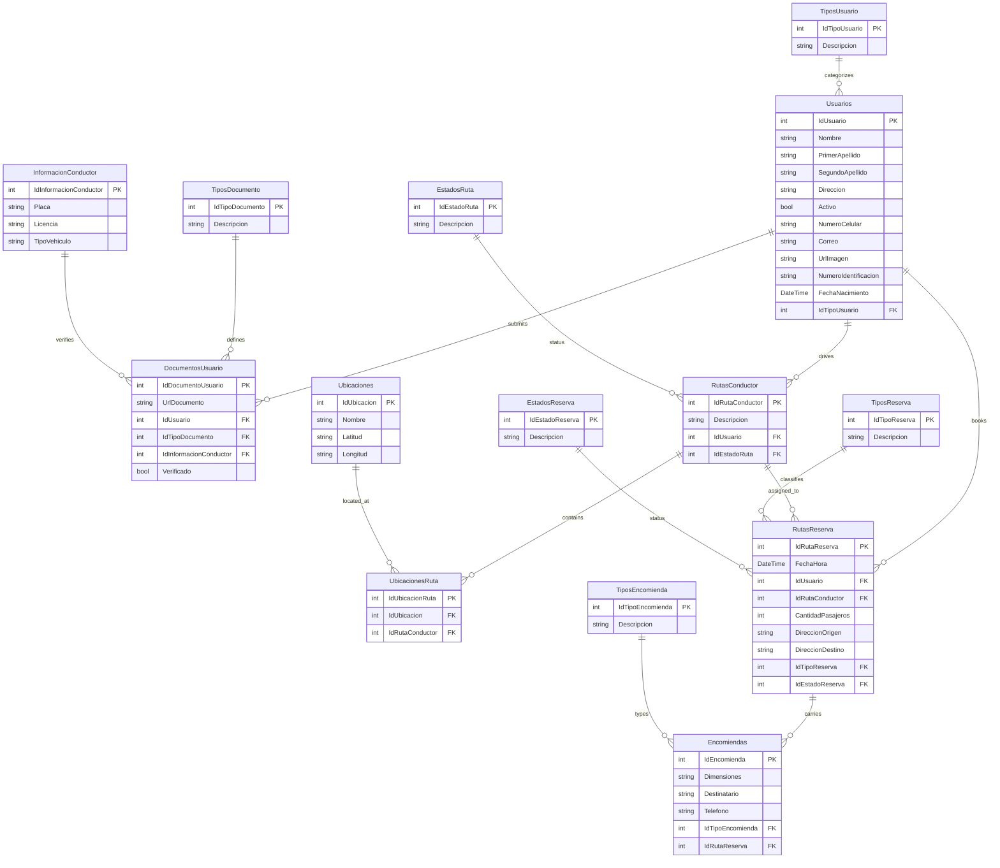

# Data Model Documentation

This document describes the database schema, entity descriptions, field definitions, relationships, and the Entity Relationship Diagram (ERD) for the **Door** application.

---

## Model Descriptions

### 1. Usuarios (Users)
Represents both passengers and drivers within the platform.

**Fields:**
- `IdUsuario`: Unique identifier (Primary Key, Identity)
- `Nombre`: First/Given name of the user (nullable)
- `PrimerApellido`: Primary last name (nullable)
- `SegundoApellido`: Secondary last name (nullable)
- `Direccion`: Address of the user (nullable)
- `Activo`: Boolean indicating whether the user is active (true/false)
- `NumeroCelular`: Cellular phone number (used as unique identifier for login/lookup)
- `Correo`: Email address of the user (nullable)
- `UrlImagen`: URL to the user's profile photo (nullable)
- `NumeroIdentificacion`: National identity card number (nullable)
- `FechaNacimiento`: Birth date (DateTime)
- `IdTipoUsuario`: Foreign Key mapping to `TiposUsuario`

**Relationships:**
- `TipoUsuario`: Many-to-one with `TiposUsuario`
- `DocumentosUsuario`: One-to-many with `DocumentosUsuario`
- `RutasConductor`: One-to-many with `RutasConductor` (active if user is a driver)
- `RutasReserva`: One-to-many with `RutasReserva` (active if user is booking a trip)

---

### 2. TiposUsuario (User Types)
Lookup table defining user profiles.

**Fields:**
- `IdTipoUsuario`: Unique identifier (Primary Key, Identity)
- `Descripcion`: Type name/description (e.g. `1` for Passenger, `2` for Driver)

**Relationships:**
- `Usuarios`: One-to-many with `Usuarios`

---

### 3. InformacionConductor (Driver Information)
Encapsulates vehicle and license metadata for registered drivers.

**Fields:**
- `IdInformacionConductor`: Unique identifier (Primary Key, Identity)
- `Placa`: Vehicle license plate number (default: "No aplica")
- `Licencia`: Driver's driving license registration number (default: "No aplica")
- `TipoVehiculo`: Category of vehicle (default: "No aplica")

**Relationships:**
- `DocumentosUsuario`: One-to-many with `DocumentosUsuario`

---

### 4. DocumentosUsuario (User Documents)
Files uploaded by users (primarily drivers) for account validation and auditing.

**Fields:**
- `IdDocumentoUsuario`: Unique identifier (Primary Key, Identity)
- `UrlDocumento`: URL to physical file stored on the server (nullable)
- `IdUsuario`: Foreign Key mapping to `Usuarios`
- `IdTipoDocumento`: Foreign Key mapping to `TiposDocumento`
- `IdInformacionConductor`: Foreign Key mapping to `InformacionConductor`
- `Verificado`: Boolean indicating if administrative verification is complete

**Relationships:**
- `Usuario`: Many-to-one with `Usuarios`
- `TipoDocumento`: Many-to-one with `TiposDocumento`
- `InformacionConductor`: Many-to-one with `InformacionConductor`

---

### 5. TiposDocumento (Document Types)
Lookup table defining validation document classes.

**Fields:**
- `IdTipoDocumento`: Unique identifier (Primary Key, Identity)
- `Descripcion`: E.g. "Identity Card", "Driving License", "Vehicle Ownership Doc"

**Relationships:**
- `DocumentosUsuario`: One-to-many with `DocumentosUsuario`

---

### 6. RutasConductor (Driver Routes)
Trips created and offered by drivers.

**Fields:**
- `IdRutaConductor`: Unique identifier (Primary Key, Identity)
- `Descripcion`: Textual description, automatically formatted as `[OriginLocationName]-[DestinationLocationName]`
- `IdUsuario`: Foreign Key referencing the driver in `Usuarios` (nullable)
- `IdEstadoRuta`: Foreign Key mapping to `EstadosRuta`

**Relationships:**
- `Usuario`: Many-to-one with `Usuarios`
- `EstadoRuta`: Many-to-one with `EstadosRuta`
- `UbicacionesRuta`: One-to-many with `UbicacionesRuta` (stops along the route)
- `RutasReserva`: One-to-many with `RutasReserva` (bookings mapping to this route)

---

### 7. EstadosRuta (Route States)
Lookup table representing the operational status of a driver's trip.

**Fields:**
- `IdEstadoRuta`: Unique identifier (Primary Key, Identity)
- `Descripcion`: E.g. "Scheduled", "Active", "Finished", "Cancelled"

**Relationships:**
- `RutasConductor`: One-to-many with `RutasConductor`

---

### 8. UbicacionesRuta (Route Locations Mapping)
A pivot table mapping route stops/checkpoints to geographical coordinates.

**Fields:**
- `IdUbicacionRuta`: Unique identifier (Primary Key, Identity)
- `IdUbicacion`: Foreign Key referencing `Ubicaciones`
- `IdRutaConductor`: Foreign Key referencing `RutasConductor` (nullable)

**Relationships:**
- `Ubicacion`: Many-to-one with `Ubicaciones`
- `RutaConductor`: Many-to-one with `RutasConductor`

---

### 9. Ubicaciones (Locations)
Cities, terminals, or waypoints supported by the platform.

**Fields:**
- `IdUbicacion`: Unique identifier (Primary Key, Identity)
- `Nombre`: Name of the coordinate point/location
- `Latitud`: Geographical latitude coordinate (nullable)
- `Longitud`: Geographical longitude coordinate (nullable)

**Relationships:**
- `UbicacionesRuta`: One-to-many with `UbicacionesRuta`

---

### 10. RutasReserva (Route Reservations)
Trips or package deliveries booked by passengers/senders on a driver's route.

**Fields:**
- `IdRutaReserva`: Unique identifier (Primary Key, Identity)
- `FechaHora`: Scheduled date and time (DateTime)
- `IdUsuario`: Foreign Key mapping to the booking user in `Usuarios`
- `IdRutaConductor`: Foreign Key mapping to the assigned route in `RutasConductor`
- `CantidadPasajeros`: Number of passenger seats requested
- `DireccionOrigen`: Detailed pick-up address text
- `DireccionDestino`: Detailed drop-off address text
- `IdTipoReserva`: Foreign Key mapping to `TiposReserva`
- `IdEstadoReserva`: Foreign Key mapping to `EstadosReserva`

**Relationships:**
- `Usuario`: Many-to-one with `Usuarios`
- `RutaConductor`: Many-to-one with `RutasConductor`
- `TipoReserva`: Many-to-one with `TiposReserva`
- `EstadoReserva`: Many-to-one with `EstadosReserva`
- `Encomiendas`: One-to-many with `Encomiendas` (cargo parcels in the booking)

---

### 11. EstadosReserva (Reservation States)
Lookup table for booking statuses.

**Fields:**
- `IdEstadoReserva`: Unique identifier (Primary Key, Identity)
- `Descripcion`: E.g. "Active/Confirmed" (1), "Cancelled" (2)

**Relationships:**
- `RutasReserva`: One-to-many with `RutasReserva`

---

### 12. TiposReserva (Reservation Types)
Defines trip configurations.

**Fields:**
- `IdTipoReserva`: Unique identifier (Primary Key, Identity)
- `Descripcion`: E.g. "Passenger Trip Only", "Cargo Shipment Only", "Mixed"

**Relationships:**
- `RutasReserva`: One-to-many with `RutasReserva`

---

### 13. Encomiendas (Cargo Parcels)
Describes items/cargo registered under a route reservation.

**Fields:**
- `IdEncomienda`: Unique identifier (Primary Key, Identity)
- `Dimensiones`: Cargo volume or dimension details (nullable)
- `Destinatario`: Full name of the package recipient (nullable)
- `Telefono`: Phone number of the recipient (nullable)
- `IdTipoEncomienda`: Foreign Key mapping to `TiposEncomienda`
- `IdRutaReserva`: Foreign Key mapping to the parent reservation in `RutasReserva` (nullable)

**Relationships:**
- `TipoEncomienda`: Many-to-one with `TiposEncomienda`
- `RutasReserva`: Many-to-one with `RutasReserva`

---

### 14. TiposEncomienda (Cargo Types)
Lookup table for categorizing parcel shipments.

**Fields:**
- `IdTipoEncomienda`: Unique identifier (Primary Key, Identity)
- `Descripcion`: E.g. "Documents", "Fragile", "Groceries", "Box/Package"

**Relationships:**
- `Encomiendas`: One-to-many with `Encomiendas`

---

## Entity Relationship Diagram

---

## Key Design Principles

1. **Strict Referential Integrity**: Implemented through Entity Framework Foreign Key constraints. Delete operations restrict cascading changes by default via `Restrict` behavior.
2. **Normalized Lookup Tables**: Enumerations like roles, document formats, trip statuses, and reservation categories are isolated in distinct types tables to improve scalability and localization.
3. **Audit Readiness**: Driver document uploads link directly to vehicle metadata and the driver's base profile, preserving history for system verification audits.
4. **Decoupled Geographical Nodes**: Locations (`Ubicaciones`) are defined independently from routes, permitting infinite route combinations (`UbicacionesRuta`) without duplicating address definitions.